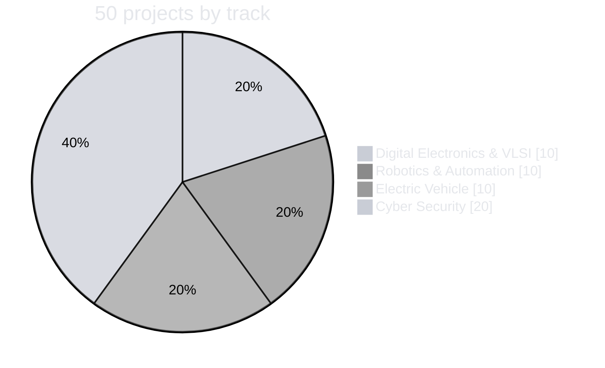

<!-- ═══════════════ CAREER CONTROL TOWER · REPOSITORY · CODEC ═══════════════ -->
<div align="center">


<a href="https://github.com/Eswar5313"></a> <a href="https://eswar5313.github.io/Eswar-Master-Project-Portfolio-2026/"></a> <a href="https://eswar5313.github.io/Eswar-Portfolio-Lens-Index-2026/"></a> <a href="https://eswar5313.github.io/Codec-Technologies-Internship-Portfolio-2026/"></a>

    

**Codec Technologies India · Intern · Aug – Sep 2026 · remote** — Digital Electronics & VLSI · Robotics & Automation · Electric Vehicle · Cyber Security (defensive only)

</div>


One repository for every Codec Technologies internship track I completed, kept deliberately compact: each track folder carries its results README, a clickable dashboard, one engineering-report PDF per project, and the engineering-report PDFs; complete source archives are available on request (EV archive published). Nothing here is a mock-up — every figure in the READMEs and reports was produced by running the code in the archives, and every tool that was *not* available is named as a declared substitution rather than implied.

## 🧭 Navigate

<div align="center">
<table><tbody>
<tr>
<td align="center" width="25%"><a href="Digital-Electronics-VLSI/"></a><br/><sub>10 projects · 10/10 run_all PASS · 12 iCE40 P&R runs</sub><br/><a href="https://eswar5313.github.io/Codec-Technologies-Internship-Portfolio-2026/Digital-Electronics-VLSI/dashboard.html">dashboard</a> · <a href="Digital-Electronics-VLSI/README.md">README</a> · <a href="Digital-Electronics-VLSI/reports/">reports</a></td>
<td align="center" width="25%"><a href="Robotics-Automation/"></a><br/><sub>10 projects · 143 unit tests · 0 collisions</sub><br/><a href="https://eswar5313.github.io/Codec-Technologies-Internship-Portfolio-2026/Robotics-Automation/dashboard.html">dashboard</a> · <a href="Robotics-Automation/README.md">README</a> · <a href="Robotics-Automation/reports/">reports</a></td>
<td align="center" width="25%"><a href="Electric-Vehicle/"></a><br/><sub>10 projects · 226 tests · EKF SOC RMSE 0.63 %</sub><br/><a href="https://eswar5313.github.io/Codec-Technologies-Internship-Portfolio-2026/Electric-Vehicle/dashboard.html">dashboard</a> · <a href="Electric-Vehicle/README.md">README</a> · <a href="Electric-Vehicle/reports/">reports</a> · <a href="https://github.com/Eswar5313/EV-Internship-Projects-Codec-2026">source archive</a></td>
<td align="center" width="25%"><a href="Cyber-Security/"></a><br/><sub>20 defensive projects · 226 tests · IDS F1 0.998</sub><br/><a href="https://eswar5313.github.io/Codec-Technologies-Internship-Portfolio-2026/Cyber-Security/dashboard.html">dashboard</a> · <a href="Cyber-Security/README.md">README</a> · <a href="Cyber-Security/reports/">reports</a></td>
</tr>
</tbody></table>
</div>

## 📊 Tracks — measured results

| Track | Projects | Verification | Highlights (measured) |
|---|---|---|---|
| **▣ Digital Electronics & VLSI** | 10 — traffic-light controller with emergency priority, low-power CMOS ALU, VHDL digital lock, FIR filter (3 architectures), UART, GSM energy meter, 4-bit CPU, RTL-to-GDSII flow, IoT home automation, digital voting machine | 10/10 `run_all.sh` PASS · Icarus Verilog / GHDL / Yosys / nextpnr-ice40 / icetime | ALU power −63.8 % · UART Fmax 135 MHz · FIR SNR 88.9 dB · 122/122 nets routed to a real GDSII · 12 real place-and-route runs |
| **◈ Robotics & Automation** | 10 — warehouse AMR (A*/Dijkstra), inspection arm (OpenCV + IK), voice-controlled home bot, self-balancing robot (PID + Kalman), surveillance drone, farming robot, gesture-controlled arm, SLAM search & rescue, automated parking, conveyor sorting | 10/10 `run_all.sh` PASS · 143 unit tests · pure-Python simulators + ROS 2 package skeletons | 0 collisions in every run · SLAM pose RMSE 0.34 m vs 1.41 m odometry · conveyor vision 99.7 % · irrigation water −77 % |
| **⚡ Electric Vehicle** | 10 — BMS simulation, charging-station locator app, solar charging station, AI driving-efficiency optimiser, drivetrain model, IoT EV health dashboard, EV lifecycle analysis, EV-priority traffic light, wireless charging design, EV market forecast dashboard | 226 tests PASS (recorded; 176 re-run in this build — SimPy/Plotly/Jest deps absent for the rest) | EKF SOC RMSE 0.63 % · GradientBoosting R² 0.975 · real IEA GEO 2026 market data |
| **⬡ Cyber Security** | 20 — two sets of ten defensive projects (IDS on NSL-KDD, phishing detection, ransomware-behaviour detector, SMS spam classifier, threat-intel k-anonymity monitor, and more) against self-contained lab targets | 226 tests PASS (recorded; 170 re-run in this build — scapy/bcrypt/argon2 absent for 5 projects) · defensive/educational only | Real datasets: NSL-KDD, URLhaus/Umbrella feeds, UCI SMS Spam |


```mermaid
%%{init: {'theme':'dark','themeVariables':{'pie1':'#C9CDD6','pie2':'#8A8A8A','pie3':'#9A9A9A','pie4':'#C9CDD6','pieTitleTextColor':'#E5E7EB','pieSectionTextColor':'#000000','pieLegendTextColor':'#E5E7EB'}}}%%
pie showData title 50 projects by track
    "Digital Electronics & VLSI" : 10
    "Robotics & Automation" : 10
    "Electric Vehicle" : 10
    "Cyber Security" : 20
```

## 🗂️ Why the compact layout

GitHub's web uploader accepts at most 100 files per upload, and the full source trees run to several hundred files per track. So each track folder is structured as:

```
<Track>/
├── README.md                     results table, how to run, declared substitutions (project names link to their report)
├── dashboard.html                clickable project cards (open in a browser)
├── reports/NN_ProjectName.pdf    one 2–4 page engineering report per project

```

**Source code:** the EV source archive is published in [EV-Internship-Projects-Codec-2026](https://github.com/Eswar5313/EV-Internship-Projects-Codec-2026); the VLSI, Robotics and Cyber source archives exceed GitHub's web-upload limit and are shared on request. To run anything: unzip, `cd` into a project folder, `./run_all.sh`. Each track README lists the toolchain it needs (OSS CAD Suite for VLSI; Python 3.11 with numpy/scipy/OpenCV for Robotics; Node for the EV app). The PASS lines and the numbers in the report regenerate.

## 🛡️ Declared substitutions (applies to every track)

Vivado, ModelSim, Cadence, Synopsys, MATLAB, Microwind, Magic, OpenROAD, KLayout, physical FPGA boards, GSM/MCU hardware, ROS/Gazebo, Webots, Unity, AirSim, RoboDK, CoppeliaSim, MediaPipe, cloud speech APIs and webcams were not available where this work was done. In every such case the engineering was implemented with open-source equivalents that actually ran, and ready-to-run files for the named tool are included and marked "provided, not run here". No result in this repository is claimed for a tool or device that did not execute it.

## 📨 Submission

Published for the Codec Technologies internship programme; the GitHub link together with the offer letter goes to vaishali@codectechnologies.in. Licence: MIT for my code; briefs and datasets belong to their respective owners.


<div align="center">

**Eswar Mahalingam** · B.Com · MBA · PGDLSCM · CSCMP SCPro · Six Sigma Black Belt
Data Scientist @ Zidio Development · Ghaziabad NCR, India · Open to India · EU (Blue Card) · Gulf · Immediate joiner

[](https://linkedin.com/in/eswar-mahalingam)
[](mailto:eswarmba05313@gmail.com)
[](tel:+919360548243)
[](https://eswar-3d-portfolio.netlify.app)
[](https://github.com/Eswar5313)


</div>
